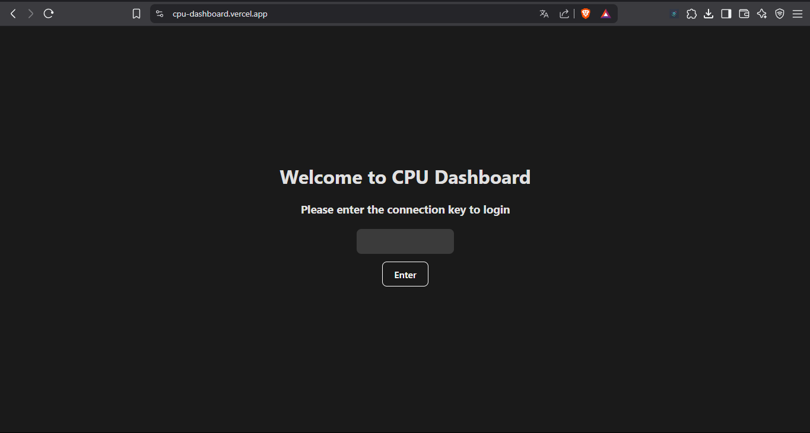
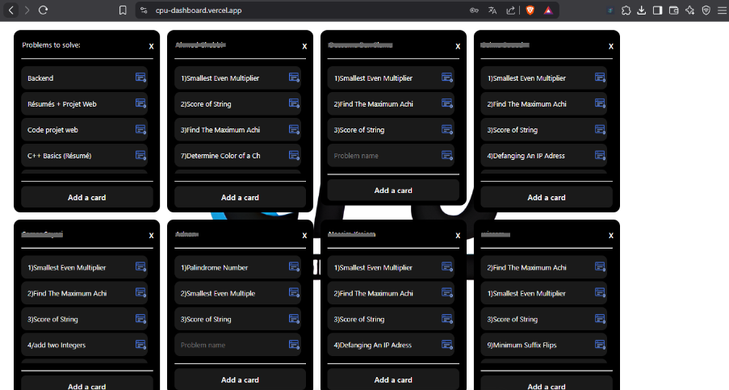
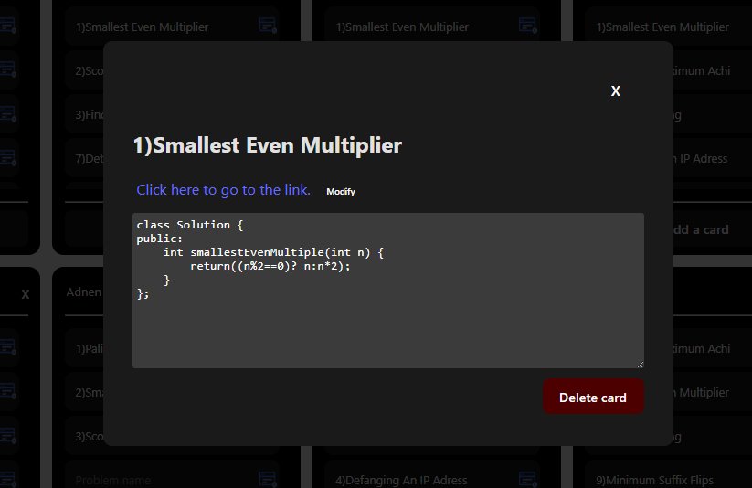

# 🧠 CPU Dashboard

A minimalist collaborative tool (like Trello) developed in just **one day** for the [CPU ISIMM Club]((https://www.linkedin.com/in/cpu-isimm-068816218)) to **manage resource sharing and problem submissions** efficiently — with **no user limits**.

> Platforms like Trello restrict collaboration to 10 users on free plans. CPU Dashboard is your **no-limit alternative**, ready to use instantly.

## 🔥 Features

- 🔐 **Login system** with password  
- 👥 **Two separate rooms** depending on the password used  
- 🧩 **Create custom lists** (Kanban-style)  
- 📝 **Add, delete, and reorder cardsby drag and drop**  
- 🔗 Each card contains:  
  - A **description**  
  - A **resource link**  
- ⚡ **Unlimited members**  
- 🎨 Clean, minimal UI — easy to use, no distractions
- 📱 **Responsive design** — fully accessible and usable on mobile devices  

## 📸 Screenshots

### 🏠 Login Page  

### 📋 Dashboard Overview  

### ➕ Adding a Card  

## 📽️ Demo Video

▶️ [Watch the full demo](https://drive.google.com/file/d/1b9suKsEI6Z2P8M8KvQWUM_npWZhEPNtO/view?usp=sharing)

## 💡 Why I Built It

Trello is great, but its **free plan limits collaboration**. For club work, problem-solving coordination, or file sharing, that’s not ideal.

We needed a:  
- 🔓 Free  
- ⚡ Fast  
- 👤 Unlimited  
- 🧠 Simple  

…platform for CPU ISIMM club activities. So, we built one.

## 🛠️ Tech Stack

- Frontend: **React** 
- Hosting: **Vercel**
  
## 🧪 Future Improvements

- Firebase / Supabase backend  
- User-specific cards
- Authentication system
- Notifications  
- File uploads  
- Dark mode 🌙  

## 👤 Author

**Mazen Toraa**  
📍 Higher Institute of Informatics and Mathematics of Monastir (ISIMM)  
🛠️ [LinkedIn](https://www.linkedin.com/in/mazen-toraa) – [GitHub](https://github.com/mazentoraa)

## 📜 License

MIT License – free to use, improve, or remix.
